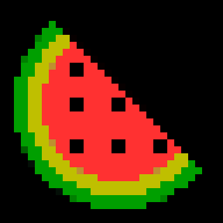
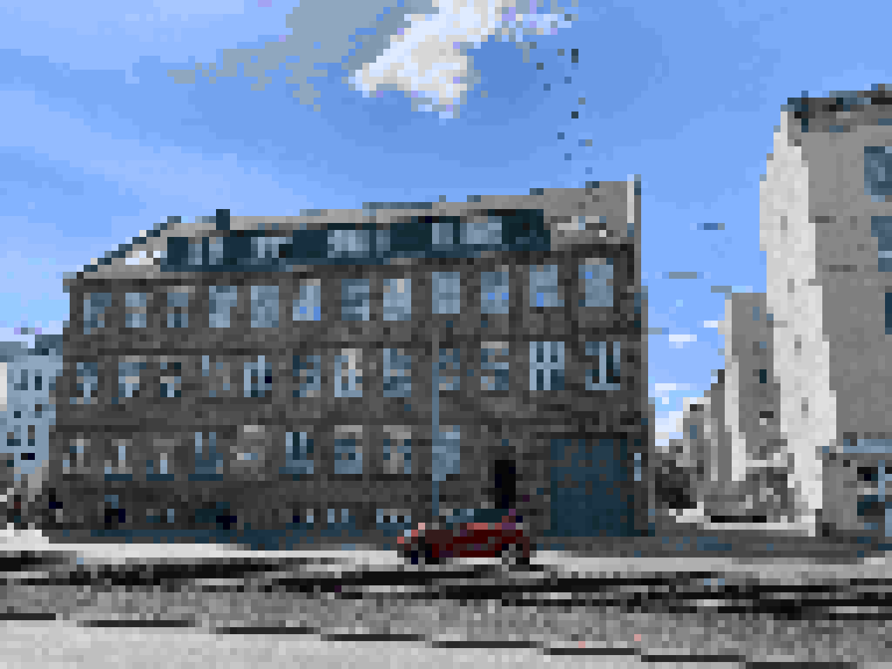
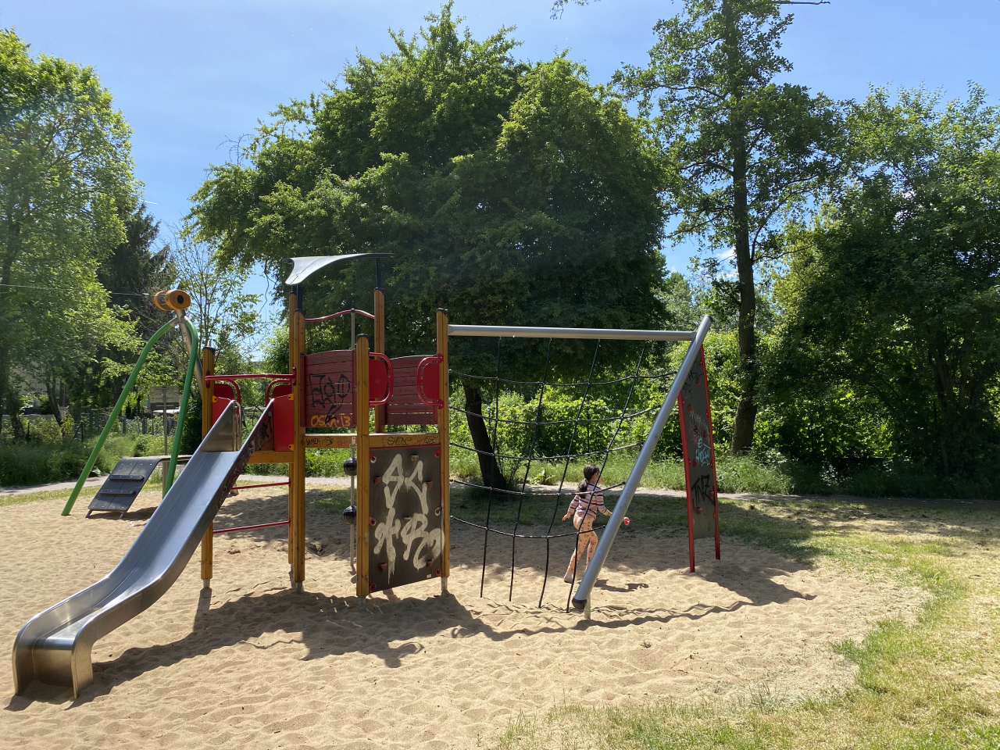
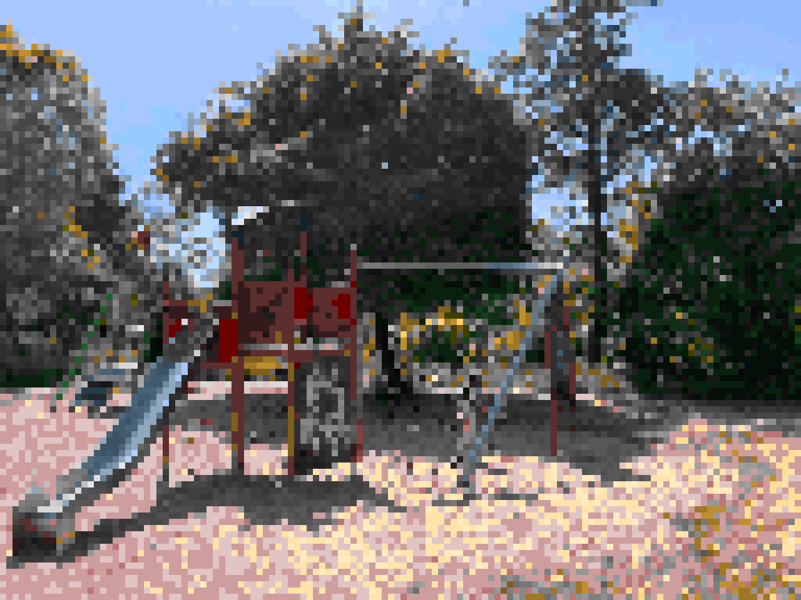

# GORK

I derived the name from Zork that is a first text-based adventure game.

```
poetry install
poetry run gork --help

# colors, texts, recognitions, etc
poetry run gork analyze --input=./files/park.png \
                        --output=./files/park_report.txt \
                        --ignore-cache

# default width, terminal width scale it by height.
poetry run gork print --width=80 \
                      --input=./files/park.png \
                      --ignore-cache

# default pixel size is 10.
poetry run gork export ./files/park.png \
                       ./files/park_output.png \
                       --pixel-size=15 \
                       --ignore-cache
```

| Original                             | Pixelated                                   |
|--------------------------------------|---------------------------------------------|
|  |  |
|         |         |
|    |    |
|            |            |
|                |                |

The terminal output:

[](https://asciinema.org/a/284169)

The base calculation code is from [pixelator][1] project. Also [img_term][2] app
helped me to display the image in the terminal.

# Contributing

```
poetry run pytest

# to generate report
poetry run coverage run -m pytest
poetry run coverage report -m
```

[1]: https://github.com/connor-makowski/pixelator
[2]: https://github.com/JonnoFTW/img_term
